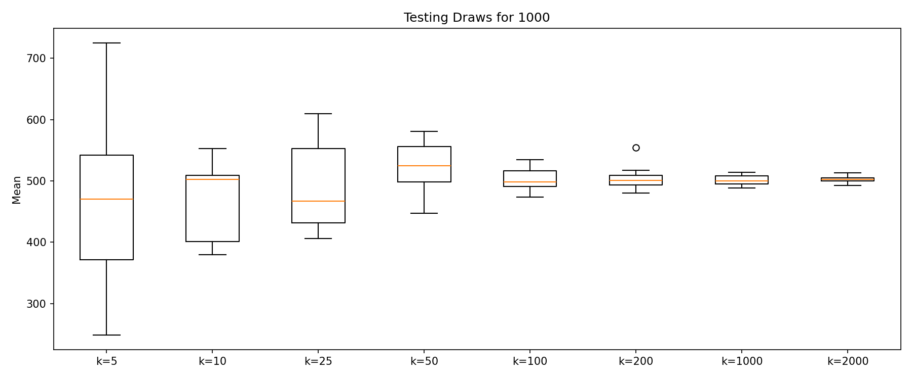

# BET-105 Assignment

Snakemake pipeline to demonstrate the law of large numbers. For each k in the config, it draws k random numbers from 1 to n, takes the mean, repeats 10 times, and makes a boxplot of the means.

## Plot



## Run

```
snakemake --cores 4
```

Edit `config.yaml` to change n, the k values, or the number of repeats.

Requirements: snakemake, numpy, pandas, matplotlib
